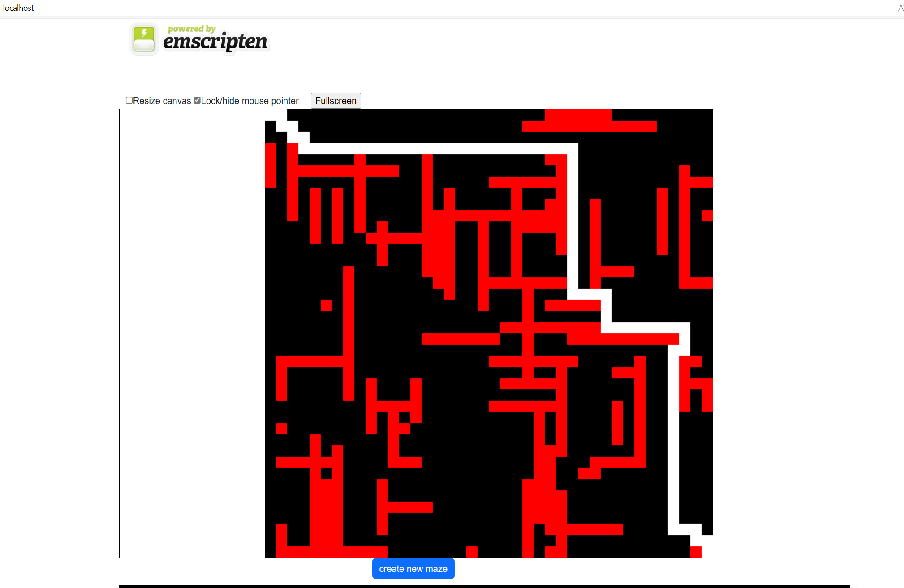

# astar maze solver with boost

- https://www.boost.org/doc/libs/1_70_0/libs/graph/example/astar_maze.cpp

```
//          Copyright W.P. McNeill 2010.
// Distributed under the Boost Software License, Version 1.0.
//    (See accompanying file LICENSE_1_0.txt or copy at
//          http://www.boost.org/LICENSE_1_0.txt)

// This program uses the A-star search algorithm in the Boost Graph Library to
// solve a maze.  It is an example of how to apply Boost Graph Library
// algorithms to implicit graphs.
//
// This program generates a random maze and then tries to find the shortest
// path from the lower left-hand corner to the upper right-hand corner.  Mazes
// are represented by two-dimensional grids where a cell in the grid may
// contain a barrier.  You may move up, down, right, or left to any adjacent
// cell that does not contain a barrier.
//
// Once a maze solution has been attempted, the maze is printed.  If a
// solution was found it will be shown in the maze printout and its length
// will be returned.  Note that not all mazes have solutions.
//
// The default maze size is 20x10, though different dimensions may be
// specified on the command line.
```

# Build Requirements

Build and Tested with Cmake from Visual Studio
- VS2022
- Ubuntu WSL - emscripten targets builds here
- Windows - build and debug the application from vs and switch to emscripten after getting it working

- https://emscripten.org/docs/getting_started/downloads.html

```
apt install cmake g++ build-essential
apt install libboost-dev libsdl2-dev 
```

Visual studio 2022 using cmake is very easy to jump between windows sdl development and emscripten builds.

# Emscripten + Embind

- https://web.dev/articles/drawing-to-canvas-in-emscripten
- https://emscripten.org/docs/porting/connecting_cpp_and_javascript/embind.html#built-in-type-conversions

# Calling C++ Functions from JS 

```c++
#ifdef __EMSCRIPTEN__
#include <emscripten/emscripten.h>
#include <emscripten/bind.h>
using namespace emscripten;

void resetMaze() {};
#endif

#ifdef __EMSCRIPTEN__
EMSCRIPTEN_BINDINGS(memory_view_example) {
	function("resetMaze", &resetMaze);
}
#endif
```

```HTML
<div class="col-sm">
	<button type="button" class="btn btn-primary"  onclick="clickMe();">create new maze</button>      
</div>
```

```JavaScript
<script type="text/javascript">
  function clickMe() {
	Module.resetMaze(); 
  }
</script>
```

# Reading C++ Global Byte Array from JS

```c++
constexpr size_t bufferLength = 1024;
unsigned char* byteBuffer = new unsigned char[bufferLength]();

#ifdef __EMSCRIPTEN__
#include <emscripten/emscripten.h>
#include <emscripten/bind.h>
using namespace emscripten;

val getBytes() {};
#endif

#ifdef __EMSCRIPTEN__
EMSCRIPTEN_BINDINGS(memory_view_example) {
	function("getBytes", &getBytes);
}
#endif
```

```JavaScript
<script type="text/javascript">
  var Module = {
	onRuntimeInitialized: function() {
	  var myUint8Array = Module.getBytes();
	  console.log(myUint8Array);		
	}
  };
</script>
```

# CMake Emscripten setup

- https://emscripten.org/docs/porting/Debugging.html
- https://emscripten.org/docs/compiling/Building-Projects.html#emscripten-ports

*Note:* I hardcoded Emscripten.cmake path.  There is certainly a proper way to do find it or set a env var.

```bash
emcc --show-ports
```

```cmake
if( ${CMAKE_SYSTEM_NAME} MATCHES "Emscripten")
    set(CMAKE_TOOLCHAIN_FILE "/home/tim/emsdk/upstream/emscripten/cmake/Modules/Platform/Emscripten.cmake" )
    set(USE_FLAGS "-s USE_BOOST_HEADERS=1 -s DISABLE_EXCEPTION_CATCHING=0 -s USE_SDL=2 -s USE_SDL_GFX=2 --bind")
    set(CMAKE_CXX_FLAGS "${CMAKE_CXX_FLAGS} ${USE_FLAGS}")
    set(CMAKE_C_FLAGS "${CMAKE_C_FLAGS} ${USE_FLAGS}")
    set(CMAKE_EXE_LINKER_FLAGS "${CMAKE_EXE_LINKER_FLAGS} ${USE_FLAGS}")
    set(CMAKE_EXECUTABLE_SUFFIX .html)
else()
    find_package(SDL2 REQUIRED)
    find_package(Boost REQUIRED)
endif()
```
